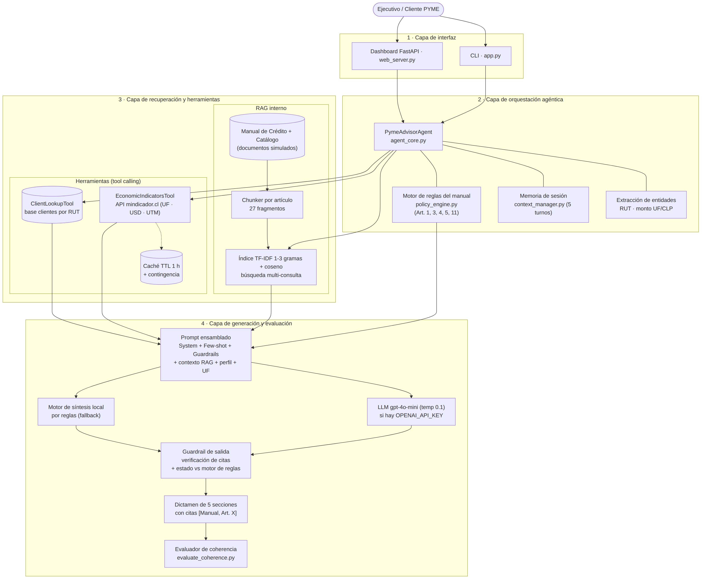

# PYME-Advisor: agente con LLM y RAG para la pre-evaluación crediticia PYME (BancoEstado Microempresas)

> **Asignatura:** ISY0101 – Ingeniería de Soluciones con IA · **Institución:** Duoc UC
> **Evaluación:** Evaluación Parcial N°1 – Diseño de solución con LLM y RAG (encargo)
> **Integrantes:** Juan Serna, Bárbara Bustamante, Nelson Carrasco

---

## 1. Descripción

**PYME-Advisor** es un agente que entrega un **dictamen preliminar de admisibilidad crediticia** para micro y pequeñas empresas, con cada afirmación respaldada por el artículo del manual interno que la sustenta.

Para cada consulta el agente:

1. **Extrae entidades** (RUT y monto en UF o pesos).
2. **Usa herramientas:** `ClientLookupTool` (base interna de clientes por RUT) y `EconomicIndicatorsTool` (API pública [mindicador.cl](https://mindicador.cl), con valores del Banco Central de Chile, para UF, dólar y UTM).
3. **Aplica el motor de reglas** del Manual de Crédito (`policy_engine.py`: Art. 1, 3, 4, 5 y 11), que fija el estado: `PRE-ADMISIBLE`, `NO ADMISIBLE`, `DERIVACIÓN A COMITÉ ESPECIAL` o `INFORMACIÓN GENERAL`.
4. **Recupera** los fragmentos normativos con **búsqueda multi-consulta**: descompone la consulta en sub-consultas por dimensión de riesgo sobre un índice TF-IDF (n-gramas 1–3, similitud coseno).
5. **Genera** el dictamen de 5 secciones con **gpt-4o-mini** (si existe `OPENAI_API_KEY`) o con el **motor de síntesis local**, que sólo cita artículos efectivamente recuperados.
6. **Verifica la salida (guardrail):** cada cita `[Manual de Crédito, Art. X]` debe estar respaldada por un fragmento recuperado, y el estado declarado debe coincidir con el motor de reglas.

> **Alcance:** la organización es real, pero el Manual de Políticas de Crédito, el Catálogo de Productos y la base de clientes son **documentos simulados** creados por el equipo para el prototipo. No son normativa oficial de BancoEstado.

---

## 2. Arquitectura



Flujo de una consulta (diagrama de secuencia): [`docs/diagramas/flujo_rag.png`](docs/diagramas/flujo_rag.png). Las fuentes Mermaid (`.mmd`) están en `docs/diagramas/` y se pueden editar en https://mermaid.live.

---

## 3. Estructura del repositorio

```text
├── app.py                         # CLI interactiva (casos de demostración, consultas libres, benchmark)
├── web_server.py                  # Dashboard web FastAPI (http://localhost:8000)
├── generate_report_docx.py        # Genera el informe técnico en Word
├── requirements.txt
├── .env.example                   # Variable opcional OPENAI_API_KEY
├── data/
│   ├── database/clientes_pyme_simulados.json      # 5 clientes simulados (RUT, antigüedad, DICOM, leverage, DSCR, ventas)
│   └── internal/
│       ├── manual_politicas_credito_pyme.md       # Manual de crédito simulado (Art. 1 a 11)
│       └── catalogo_productos_financieros.md      # Catálogo simulado (Secciones 1 a 4)
├── src/
│   ├── agent/
│   │   ├── agent_core.py          # Orquestador: herramientas → reglas → RAG → generación → verificación
│   │   ├── policy_engine.py       # Motor de reglas del manual (estado preliminar determinista)
│   │   ├── prompts.py             # System prompt, few-shot y ensamblado del prompt
│   │   └── context_manager.py     # Memoria de sesión (ventana de 5 turnos) y cliente activo
│   ├── rag/
│   │   ├── document_loader.py     # Carga de documentos internos
│   │   ├── chunker.py             # Segmentación por artículo / sección (27 fragmentos)
│   │   └── vector_store.py        # Índice TF-IDF y búsqueda por similitud coseno
│   ├── tools/
│   │   ├── client_lookup.py       # Herramienta interna: clientes por RUT
│   │   ├── economic_indicators.py # Herramienta externa: API mindicador.cl con caché y respaldo
│   │   └── indicators_cache.json  # Último valor real obtenido de la API
│   └── evaluation/
│       └── evaluate_coherence.py  # Batería IE6: 7 casos y métricas de coherencia
├── tests/                         # 17 pruebas unittest (RAG, herramientas, reglas, guardrails)
└── docs/
    ├── INFORME_TECNICO_SOLUCION_RAG.docx   # Informe técnico entregado (≤ 5 páginas)
    ├── 01_PROPUESTA_CASO_ORGANIZACIONAL.md # Anteproyecto
    ├── 02_ARQUITECTURA_Y_DIAGRAMAS.md      # Detalle de arquitectura
    ├── 03_INFORME_TECNICO_SOLUCION_RAG.md  # Versión Markdown del informe
    ├── 04_GUION_DEFENSA_ORAL_20MIN.md      # Guion de la presentación
    ├── diagramas/                          # Arquitectura y flujo RAG (.mmd y .png)
    ├── bocetos/                            # Wireframe del dashboard
    └── evidencias/                         # Logs de pruebas, benchmark, demo y capturas
```

---

## 4. Instalación

Requisitos: **Python 3.10 o superior**. La conexión a internet es opcional: sin ella, la herramienta de indicadores usa el último valor guardado.

```bash
git clone https://github.com/nelscarrasco/PYME-Advisor_ISY0101_BancoEstado.git
cd PYME-Advisor_ISY0101_BancoEstado

python -m venv venv
# Windows PowerShell:
.\venv\Scripts\Activate.ps1
# Linux / macOS:
source venv/bin/activate

pip install -r requirements.txt
```

**(Opcional) Activar el LLM:** defina `OPENAI_API_KEY` (ver `.env.example`). Con la variable definida, el agente redacta con `gpt-4o-mini` (temperatura 0,1). Sin ella, usa el motor de síntesis local. El motor de reglas y el guardrail de citas funcionan igual en ambos modos.

```powershell
$env:OPENAI_API_KEY="sk-..."   # Windows PowerShell
```

> Todos los comandos se ejecutan desde la raíz del repositorio (la carpeta donde está `app.py`).

---

## 5. Ejecución

| Objetivo | Comando |
| :--- | :--- |
| CLI interactiva | `python app.py` |
| Dashboard web (para la presentación) | `python web_server.py` y abrir **http://localhost:8000** |
| Batería de coherencia IE6 (7 casos) | `python -m src.evaluation.evaluate_coherence` |
| Pruebas unitarias (17) | `python -m unittest discover tests -v` |
| Demo del agente (3 consultas) | `python -m src.agent.agent_core` |
| Regenerar el informe Word | `python generate_report_docx.py` |

**Consultas de ejemplo** (RUT de la base simulada):

- `Represento a Transportes y Logistica Biobio SpA (RUT 76.123.456-K). Queremos 1.500 UF para renovar un camión.` → PRE-ADMISIBLE, Leasing
- `Panaderia y Alimentos El Trigal EIRL (RUT 76.999.888-4) solicita 800 UF de capital de trabajo.` → NO ADMISIBLE (Art. 4)
- `Constructora del Sur SA (RUT 76.543.210-8) solicita 4.000 UF.` → COMITÉ (leverage 3,4x y DSCR 1,1)
- `Comercializadora Fruticola Express SpA (RUT 78.111.222-1) solicita 500 UF.` → NO ADMISIBLE (Art. 3)
- `TecnoAgro Sustentable Ltda (RUT 77.987.654-3) necesita 600 UF de capital de trabajo.` → PRE-ADMISIBLE

---

## 6. Resultados de la evaluación (IE6)

Batería de 7 casos con resultado esperado conocido (`src/evaluation/evaluate_coherence.py`), en modo motor local:

| Métrica | Qué mide | Resultado |
| :--- | :--- | :---: |
| Precisión de dictamen | Estado obtenido = estado esperado | **100%** |
| Recall de recuperación | Artículos que el caso necesita presentes en los fragmentos recuperados | **100%** (línea base con la consulta original, top-3: 17,1%) |
| Recall de citas | Artículos esperados citados en la respuesta | **100%** |
| Groundedness de citas | Citas respaldadas por un fragmento recuperado | **100%** |
| Consistencia UF→CLP | Monto en CLP = monto UF × UF de la herramienta | **100%** |
| Latencia media | Tiempo por consulta (motor local) | **< 0,3 s** |
| Pruebas unitarias | `unittest` | **17 / 17 OK** |

Evidencia completa (logs y capturas): [`docs/evidencias/`](docs/evidencias/). Boceto de la interfaz: [`docs/bocetos/wireframe_dashboard.png`](docs/bocetos/wireframe_dashboard.png).

### Limitaciones

- Las métricas se midieron **sin LLM** (motor local determinista). Con `gpt-4o-mini` la redacción varía y debe re-evaluarse con la misma batería; el guardrail marca las citas sin respaldo y corrige el estado si contradice al motor de reglas.
- El índice TF-IDF es léxico y las similitudes son moderadas (0,2 a 0,6). Con un corpus más grande convendría usar embeddings densos.
- Los documentos normativos y los clientes son simulados.

---

## 7. Declaración de uso de inteligencia artificial

Conforme a las indicaciones de la evaluación (https://bibliotecas.duoc.cl/ia), el equipo declara el uso de IA generativa como apoyo:

- **Claude (Anthropic):** revisión de completitud frente a la pauta; corrección y ampliación del código (motor de reglas, recuperación multi-consulta, verificación de citas, evaluador y pruebas); redacción del README y del informe; diagramas, boceto y captura de evidencias.
- _[Completar: otras herramientas de IA utilizadas por el equipo y para qué]_

Todo el contenido generado con IA fue revisado y validado por el equipo.

Anthropic. (2026). *Claude* (versión Opus 5.5) [Modelo de lenguaje de gran tamaño]. https://claude.ai
