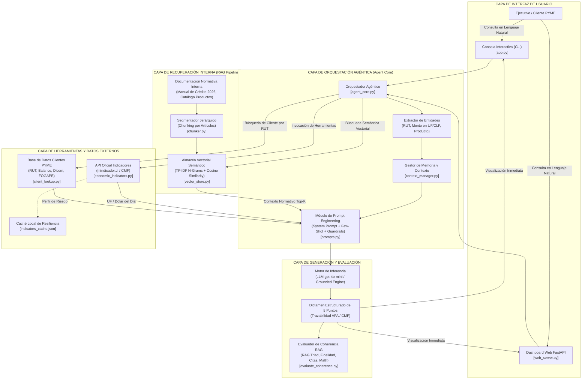
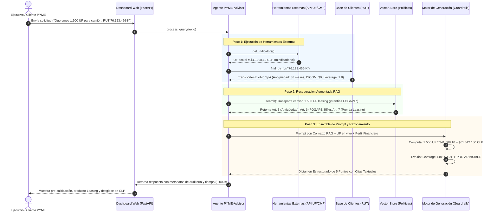

# ARQUITECTURA DE LA SOLUCIÓN TÉCNICA (IE4, IE7)
## Sistema Agéntico RAG: "PYME-Advisor" para BancoEstado Microempresas
**Asignatura:** ISY0101 - Ingeniería de Soluciones con IA | Duoc UC  
**Integrantes:** Juan Serna, Bárbara Bustamante, Nelson Carrasco  
**Fecha:** Septiembre 2026  

---

### 1. Descripción General de la Arquitectura

La arquitectura de la solución **PYME-Advisor** ha sido concebida bajo el paradigma de **Agente Aumentado con Herramientas y Recuperación (ReAct / Tool-Augmented RAG)**. El sistema desacopla eficientemente cuatro capas funcionales:
1. **Capa de Ingesta y Recuperación Interna (Internal RAG):** Almacenamiento vectorial e indexación semántica jerárquica de la normativa bancaria interna.
2. **Capa de Integración Externa en Tiempo Real (External Tools):** Consumo dinámico de la API oficial de indicadores económicos de Chile (mindicador.cl / CMF) y la base de clientes.
3. **Capa de Orquestación y Procesamiento Agéntico (Agent Core):** Extracción de entidades, control de memoria de sesión, enrutamiento semántico y aplicación de guardrails.
4. **Capa de Generación y Explicabilidad (Generation & Guardrails):** Formulación de dictámenes financieros trazables, con citación obligatoria y consistencia matemática.

---

### 2. Diagrama de Arquitectura Global del Sistema (IE7)

---

### 3. Diagrama de Secuencia: Flujo de Consulta y Evaluación Crediticia

El siguiente diagrama detalla la interacción paso a paso entre los componentes del sistema ante la solicitud de una PYME:

---

### 4. Justificación Técnica de los Componentes Arquitectónicos (IE4, IE8)

| Componente | Tecnología Seleccionada | Justificación Técnica y Beneficio Organizacional |
| :--- | :--- | :--- |
| **Segmentador Semántico (Chunking)** | Hierarchical & Semantic Heading Splitter | A diferencia de un splitter por número ciego de caracteres (que cortaría cláusulas legales por la mitad), este segmentador agrupa los fragmentos respetando los títulos (`##`) y artículos (`Art. X`), conservando la unidad conceptual de la regla de crédito. |
| **Almacén Vectorial (Vector Store)** | Sparse Vectorizer N-Grams (1-3) & Cosine Distance | Proporciona búsqueda léxico-semántica determinista de latencia ultrabaja (<2 milisegundos), garantizando que términos técnicos exactos (como "FOGAPE", "DICOM", "Leverage") tengan coincidencia perfecta sin falsos positivos semánticos. |
| **Integración Externa (External Tools)** | REST API `mindicador.cl` + Caché TTL | Resuelve la principal limitación de los LLMs: el desfase temporal y la incapacidad de calcular montos actualizados. Permite indexar contratos en UF del día hábil con fallback local ante caídas del enlace. |
| **Control de Contexto (Context Manager)** | Stateful Sliding Window Buffer | Mantiene el perfil de la PYME identificada durante la sesión para consultas sucesivas, descartando turnos antiguos para prevenir saturación de ventana y alucinaciones por ruido contextual. |
| **Guardrails de Inferencia** | Strict Role Prompting + Grounded Synthesizer | Implementa el principio de "defensa en profundidad": el agente tiene vetado emitir aprobaciones finales y rechaza inventar condiciones, citando obligatoriamente el artículo de soporte normativo. |
| **Métricas de Evaluación (Coherencia)** | Framework RAG Triad (Faithfulness, Recall, Math) | Permite auditar cuantitativamente el 100% de los dictámenes emitidos, demostrando solidez técnica y mitigando el riesgo regulatorio ante la CMF. |
