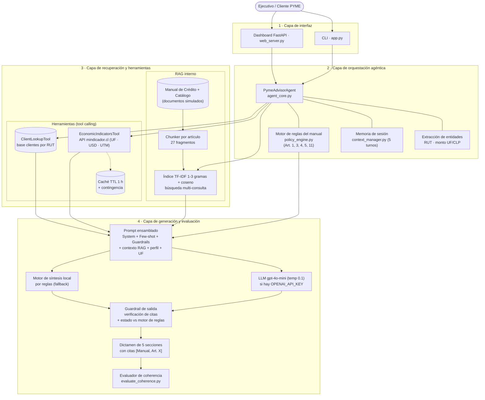
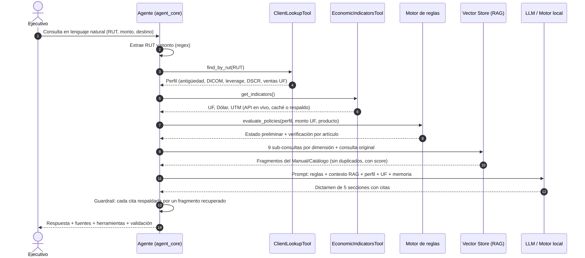
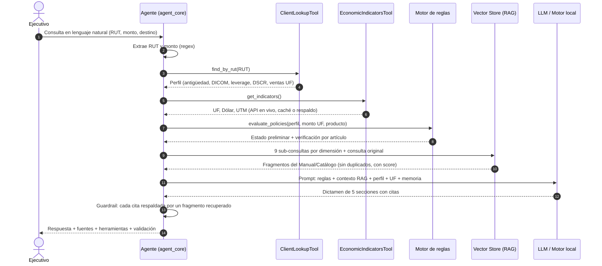

# Arquitectura de la solución (IE4, IE7)
## PYME-Advisor – Agente con LLM y RAG para BancoEstado Microempresas
**Asignatura:** ISY0101 – Ingeniería de Soluciones con IA | Duoc UC
**Integrantes:** Juan Serna, Bárbara Bustamante, Nelson Carrasco
**Fecha:** septiembre de 2026

---

### 1. Visión general

La solución sigue el patrón de **agente aumentado con herramientas y recuperación** (ReAct / tool-augmented RAG; Yao et al., 2023; Lewis et al., 2020) y se organiza en cuatro capas:

1. **Interfaz:** CLI (`app.py`) y dashboard web FastAPI (`web_server.py`) con panel de auditoría.
2. **Orquestación agéntica:** `agent_core.py` coordina extracción de entidades, herramientas, motor de reglas (`policy_engine.py`), recuperación, generación y verificación; `context_manager.py` mantiene la memoria de sesión.
3. **Recuperación y herramientas:** índice TF-IDF sobre el Manual de Crédito y el Catálogo (27 fragmentos por artículo/sección), base interna de clientes por RUT y API pública mindicador.cl (UF, dólar, UTM) con caché y respaldo.
4. **Generación y evaluación:** gpt-4o-mini (si existe `OPENAI_API_KEY`) o motor de síntesis local; guardrail de salida que verifica citas y estado; evaluador de coherencia (`evaluate_coherence.py`).

---

### 2. Diagrama de arquitectura

---

### 3. Flujo de una consulta (secuencia)

**Ejemplo (Caso 1, Transportes Biobío, 1.500 UF para un camión):**
1. Se extraen el RUT 76.123.456-K y el monto de 1.500 UF.
2. `ClientLookupTool` entrega: 36 meses, DICOM $0, leverage 1,8x, DSCR 1,45 y ventas de 8.500 UF.
3. `EconomicIndicatorsTool` entrega la UF del día y el monto se convierte a CLP (1.500 × UF).
4. El motor de reglas verifica los Art. 1, 3, 4 y 5 (límite de leverage de 3,2x para transporte) → **PRE-ADMISIBLE**; el producto detectado es **Leasing**.
5. La búsqueda multi-consulta recupera, entre otros, los Art. 3, 4, 5, 6, 7 y 9 y las Secciones 1 y 2 del catálogo.
6. El dictamen cita sólo esos artículos; el guardrail confirma que las 9 citas tienen respaldo.

---

### 4. Componentes y decisiones de diseño (IE4, IE8)

| Componente | Implementación | Justificación |
| :--- | :--- | :--- |
| Segmentación | Por encabezado Markdown y artículo (`chunker.py`) | Una regla y su excepción quedan en el mismo fragmento y la cita al artículo es inequívoca. |
| Índice vectorial | TF-IDF sublineal, n-gramas 1–3, coseno (`vector_store.py`) | Corpus pequeño con terminología exacta (DICOM, FOGAPE, UF); determinista, sin costo ni dependencias externas. Con un corpus mayor se migraría a embeddings densos. |
| Recuperación multi-consulta | Sub-consultas por dimensión de riesgo (`agent_core._retrieve`) | Una solicitud involucra varias reglas; medido en la batería: recall de recuperación de 17,1% (sólo la consulta original, top-3) a 100%. |
| Motor de reglas | `policy_engine.py` (Art. 1, 3, 4, 5 y 11) | La decisión crediticia debe ser reproducible y auditable; el LLM explica, no decide. |
| Herramienta externa | API mindicador.cl + caché de 1 h + último valor real + contingencia | Resuelve el desfase temporal del LLM sin inventar valores si la API falla, e informa siempre la fuente usada. |
| Memoria | Ventana de 5 turnos y cliente activo (`context_manager.py`) | Permite preguntas de seguimiento ("¿y qué documentos necesito?") sin saturar el prompt. |
| Prompt | Rol, reglas negativas, citas obligatorias, few-shot, estado impuesto por el motor, temperatura 0,1 (`prompts.py`) | Reduce el espacio de respuesta a lo que el contexto respalda y estabiliza el formato de 5 secciones. |
| Guardrail de salida | `validate_citations` y control de estado | Toda cita sin fragmento de respaldo se marca y se advierte al ejecutivo; si el LLM contradice al motor de reglas, prevalece el motor. |
| Evaluación | `evaluate_coherence.py` (7 casos) | Mide precisión de dictamen, recall de recuperación y de citas, groundedness de citas y consistencia UF→CLP. |

---

### 5. Referencias

- Lewis, P., Perez, E., Piktus, A., Petroni, F., Karpukhin, V., Goyal, N., Küttler, H., Lewis, M., Yih, W., Rocktäschel, T., Riedel, S., & Kiela, D. (2020). Retrieval-augmented generation for knowledge-intensive NLP tasks. *Advances in Neural Information Processing Systems, 33*, 9459–9474.
- Yao, S., Zhao, J., Yu, D., Du, N., Shafran, I., Narasimhan, K., & Cao, Y. (2023). ReAct: Synergizing reasoning and acting in language models. *International Conference on Learning Representations (ICLR 2023)*.
